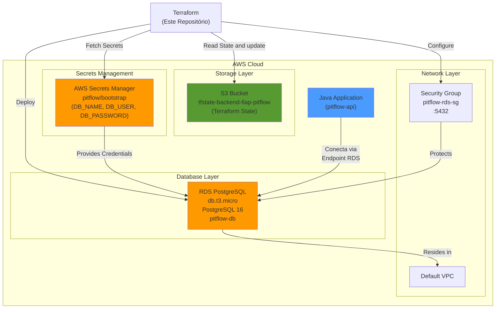

# Pitflow Database

Repositório centralizado de infraestrutura para o banco de dados PostgreSQL do **Pitflow**

## 📋 Descrição do Projeto

O **pitflow-database** é responsável por provisionar e gerenciar a infraestrutura de dados do Pitflow através do **Terraform**. Este repositório faz parte de uma estratégia descentralizada onde cada componente (API Java, banco de dados, etc.) possui sua própria infraestrutura isolada.

### Contexto de Negócio

O banco de dados suporta um sistema de oficina com os seguintes fluxos:
- **Clientes** solicitam **Ordens de Serviço** (Service Orders)
- Ordens podem incluir **Troca de Peças** ou **Manutenção**
- Gerenciamento de **Veículos**, **Mecânicos** e **Itens de Serviço**
- Rastreamento completo do ciclo de vida do atendimento


## 🛠 Tecnologias Utilizadas

| Componente | Versão/Stack | Descrição |
|-----------|--------------|-----------|
| **Banco de Dados** | PostgreSQL 16 | Engine relacional principal |
| **Infraestrutura** | Terraform ~5.0 | Infrastructure as Code (IaC) |
| **Cloud Provider** | AWS | Hospedagem dos recursos |
| **RDS Instance** | db.t3.micro | Instância gerenciada do PostgreSQL |
| **Secrets Manager** | AWS | Armazenamento seguro de credenciais |
| **Networking** | VPC + Security Group | Isolamento e controle de acesso |

## 🏗️ Arquitetura



## 📦 Estrutura do Projeto

```
infra/
└── terraform/
    ├── backend.tf          # Configuração do state remoto (S3)
    ├── provider.tf         # Definição do provider AWS
    ├── variables.tf        # Variáveis de entrada
    ├── locals.tf          # Valores calculados localmente
    ├── data.tf            # Fontes de dados (Secrets Manager)
    ├── rds.tf             # Recursos: RDS, Security Group, Outputs
    └── terraform.tfvars   # Valores das variáveis (não comitar sensíveis)
```

## 🚀 Passos para Execução e Deploy

### Pré-requisitos

- ✅ **Terraform** >= 1.0 instalado
- ✅ **AWS CLI** configurada com credenciais apropriadas
- ✅ **S3 Bucket** `tfstate-backend-fiap-pitflow` criado manualmente
- ✅ **Secret** `pitflow/bootstrap` criado no AWS Secrets Manager com as credenciais:
  ```json
  {
    "DB_NAME": "pitflow_db",
    "DB_USER": "postgres",
    "DB_PASSWORD": "sua_senha_segura"
  }
  ```
### Github action
Action diponível em: https://github.com/pitflow-so/pitflow-database/actions/workflows/main.yaml <br>
Código da action: [main.yaml](.github\workflows\main.yaml)

### Execução local

1. **Clone o repositório**
   ```bash
   git clone <repository-url>
   cd pitflow-database
   ```

2. **Inicialize o Terraform**
   ```bash
   cd infra/terraform
   terraform init
   ```
   OBS: para execução do tfstate local é necessário comentar o conteúdo do arquivo [backend.tf](infra\terraform\backend.tf) <br>
   Saída esperada: Backend configurado, providers baixados

### Planejamento

3. **Valide a configuração**
   ```bash
   terraform validate
   ```

4. **Visualize o plano de deployment**
   ```bash
   terraform plan -out=tfplan
   ```
   Esperado: Criação de 1 Security Group + 1 RDS Instance

### Aplicação da Infraestrutura

5. **Aplique as mudanças**
   ```bash
   terraform apply tfplan
   ```
   ou
   ```bash
   terraform apply
   ```

6. **Capture o endpoint do RDS**
   ```bash
   terraform output rds_endpoint
   ```
   Saída exemplo: `pitflow-db.abcdefghij.us-east-1.rds.amazonaws.com`


## 📝 Variáveis de Ambiente

| Variável | Padrão | Descrição |
|----------|--------|-----------|
| `secret_name` | `pitflow/bootstrap` | Nome do secret no AWS Secrets Manager |

## Justificativa do banco PostgreSQL

Escolhemos PostgreSQL por ser um SGBD relacional maduro, com forte suporte ACID, ótimo desempenho e ampla integração com o ecossistema Java (JDBC / Spring). Nossa equipe já possui experiência com Postgres, o que reduz risco operacional. <br>
Para o domínio de oficinas, com entidades relacionadas como `service_order` e `service_order_item` o PostgreSQL facilita modelagem relacional (FKs, constraints) e garante idempotência e controle de concorrência com padrões nativos (unique constraints, locks e transações), evitando duplicidade e condições de corrida ao criar/atualizar ordens e itens.

### Pontos técnicos
* Experiência da equipe: menor curva de aprendizado e operação.
* Consistência ACID: transações garantem integridade entre ordens e itens.
* Idempotência nativa: UNIQUE + ON CONFLICT (upsert) para evitar duplicatas.
* Controle de concorrência.
* Modelagem relacional: FKs, constraints e índices para relacionamentos e consultas eficientes.
