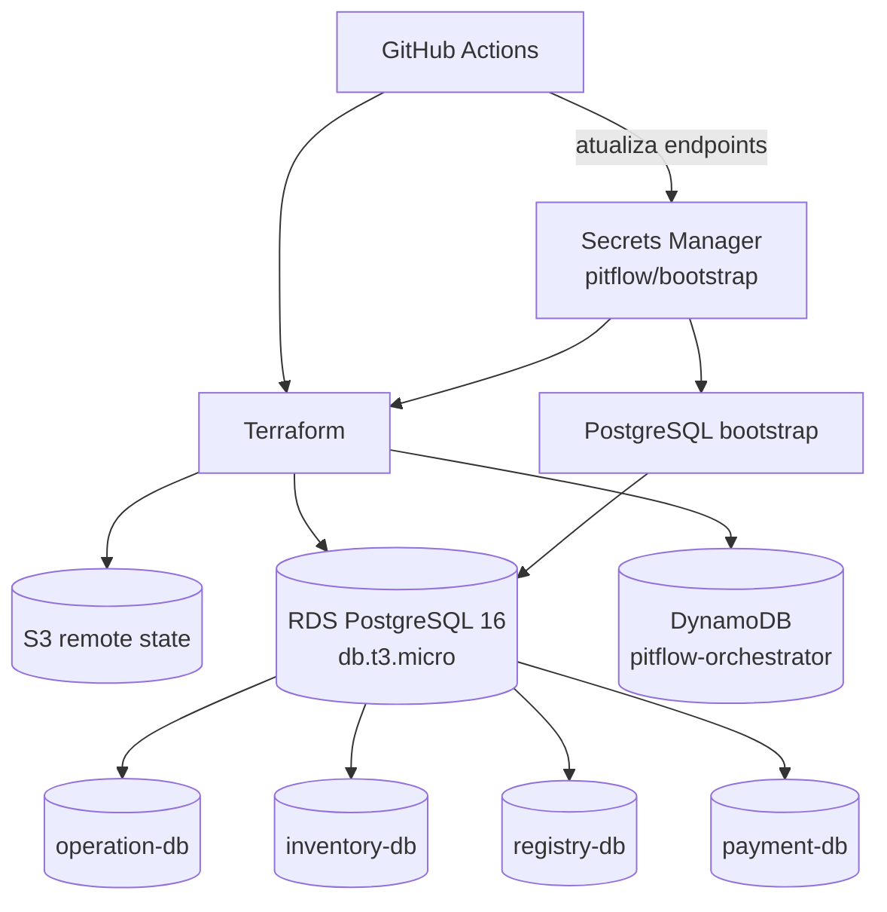

# Pitflow Database

Infraestrutura de bancos de dados do Pitflow na AWS, provisionada com Terraform.

O ambiente é acadêmico e descartável, mas representa uma arquitetura próxima de produção: cada microsserviço possui banco e credenciais próprios, o state é remoto e senhas não são versionadas no repositório.

## Arquitetura

Para reduzir custos, os quatro serviços relacionais compartilham uma única instância RDS PostgreSQL, com isolamento lógico por database e usuário. O orquestrador SAGA usa DynamoDB.

| Serviço | Tecnologia | Recurso lógico |
|---|---|---|
| `operation` | PostgreSQL 16 | `pitflow-operation-db` |
| `inventory` | PostgreSQL 16 | `pitflow-inventory-db` |
| `registry` | PostgreSQL 16 | `pitflow-registry-db` |
| `payment` | PostgreSQL 16 | `pitflow-payment-db` |
| `orchestrator` | DynamoDB | `pitflow-orchestrator` |



### RDS PostgreSQL

- identificador: `pitflow-operation-db`;
- engine: PostgreSQL 16;
- classe: `db.t3.micro`;
- armazenamento: 20 GiB;
- Single-AZ;
- publicamente acessível para o laboratório;
- sem deletion protection;
- sem snapshot final;
- uma instância física e quatro databases lógicos;
- usuário e senha exclusivos por microsserviço.

O usuário de operation também é o usuário master da instância neste ambiente. O script de bootstrap cria os outros usuários e databases, revoga o acesso público aos quatro databases e concede a cada usuário acesso ao seu próprio database.

### DynamoDB

A tabela do orquestrador usa:

- billing `PAY_PER_REQUEST`;
- chave composta `PK` e `SK`;
- TTL pelo atributo `expiresAt`;
- PITR desabilitado;
- criptografia padrão do serviço;
- GSIs para consulta por ordem, estado/timeout e outbox.

O DynamoDB usa autenticação IAM. Não existem host, porta, username ou password para o orquestrador.

## Estrutura do repositório

```text
.
├── .github/workflows/main.yaml
├── infra/terraform
│   ├── backend.tf
│   ├── data.tf
│   ├── dynamodb.tf
│   ├── locals.tf
│   ├── outputs.tf
│   ├── provider.tf
│   ├── rds.tf
│   └── variables.tf
├── scripts/bootstrap-postgres.sh
└── DEPLOYMENT.md
```

## Secrets Manager

O secret `pitflow/bootstrap` é criado pelo repositório `pitflow-bootstrap`. Antes desta infraestrutura ser executada, ele deve conter:

```text
PITFLOW_OPERATION_DB_NAME
PITFLOW_OPERATION_DB_USERNAME
PITFLOW_OPERATION_DB_PASSWORD

PITFLOW_INVENTORY_DB_NAME
PITFLOW_INVENTORY_DB_USERNAME
PITFLOW_INVENTORY_DB_PASSWORD

PITFLOW_REGISTRY_DB_NAME
PITFLOW_REGISTRY_DB_USERNAME
PITFLOW_REGISTRY_DB_PASSWORD

PITFLOW_PAYMENT_DB_NAME
PITFLOW_PAYMENT_DB_USERNAME
PITFLOW_PAYMENT_DB_PASSWORD
```

Depois do apply, o workflow preserva o conteúdo existente e atualiza automaticamente:

```text
PITFLOW_OPERATION_DB_HOST
PITFLOW_OPERATION_DB_PORT
PITFLOW_INVENTORY_DB_HOST
PITFLOW_INVENTORY_DB_PORT
PITFLOW_REGISTRY_DB_HOST
PITFLOW_REGISTRY_DB_PORT
PITFLOW_PAYMENT_DB_HOST
PITFLOW_PAYMENT_DB_PORT
PITFLOW_ORCHESTRATOR_TABLE_NAME
PITFLOW_ORCHESTRATOR_AWS_REGION
```

Os quatro bancos PostgreSQL recebem o mesmo host e porta, mas mantêm nomes e credenciais diferentes.

## GitHub Actions

O workflow é disparado:

- automaticamente em push para `main` quando Terraform, o bootstrap ou o próprio workflow mudarem;
- manualmente por `workflow_dispatch`, sem parâmetros.

Fluxo único:

```text
Configurar credenciais AWS
→ terraform init
→ terraform fmt -check
→ terraform validate
→ terraform plan
→ terraform apply
→ capturar outputs não sensíveis
→ executar bootstrap PostgreSQL
→ atualizar endpoints no Secrets Manager
```

As credenciais AWS vêm dos GitHub Secrets da organização:

```text
AWS_ACCESS_KEY_ID
AWS_SECRET_ACCESS_KEY
AWS_SESSION_TOKEN
```

Não há validação customizada dessas credenciais. Se estiverem ausentes, inválidas ou expiradas, `aws-actions/configure-aws-credentials` encerra naturalmente o workflow.

## Bootstrap PostgreSQL

O provider AWS cria a instância, mas não gerencia databases e roles dentro do PostgreSQL. Por isso, [bootstrap-postgres.sh](scripts/bootstrap-postgres.sh) é executado depois do apply.

O script:

1. recebe host, porta e ID do secret por variáveis de ambiente;
2. lê nomes, usuários e senhas no Secrets Manager;
3. conecta ao database administrativo `postgres` usando operation;
4. cria ou atualiza os quatro usuários;
5. cria os quatro databases quando não existirem;
6. configura ownership e privilégios de conexão.

Ele é idempotente: pode ser executado novamente em um recurso já existente.

Dependências do runner:

- AWS CLI;
- `jq`;
- cliente `psql`.

O workflow instala `postgresql-client` somente quando `psql` não estiver disponível.

## Execução local

Pré-requisitos:

- Terraform >= 1.5;
- AWS CLI com credenciais temporárias válidas;
- secret `pitflow/bootstrap` existente;
- backend S3 `tfstate-backend-fiap-pitflow` existente.

```bash
cd infra/terraform
terraform init
terraform fmt -check -recursive
terraform validate
terraform plan
```

Não use arquivos `.tfvars` versionados para senhas. O apply normalmente deve ser executado pelo GitHub Actions, que também realiza o bootstrap e atualiza o secret.

## Outputs Terraform

| Output | Descrição |
|---|---|
| `postgres_host` | Host compartilhado do RDS |
| `postgres_port` | Porta PostgreSQL |
| `postgres_instance_identifier` | Identificador físico do RDS |
| `postgres_database_names` | Mapa dos quatro databases lógicos |
| `orchestrator_table_name` | Nome da tabela DynamoDB |
| `orchestrator_table_arn` | ARN para políticas IAM do runtime |
| `orchestrator_table_region` | Região da tabela |

Nenhum output expõe senha.

## Ciclo descartável

O Learner Lab pode remover os recursos. Quando isso ocorrer, inicie o laboratório, atualize as credenciais temporárias da organização e execute novamente o workflow. O Terraform recriará os recursos ausentes e publicará os novos endpoints no secret.

Consulte [DEPLOYMENT.md](DEPLOYMENT.md) para o passo a passo operacional.
